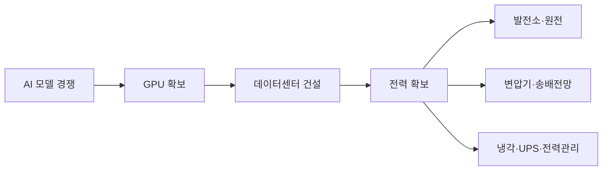

## 결론

이 흐름에서 가장 먼저 주목할 종목은 원전 개발 스타트업보다 다음 순서입니다.

> **① 이미 가동 중인 원전을 보유한 발전회사 → ② 변압기·배전·송전망 기업 → ③ 데이터센터 전력장비 기업 → ④ 원전 주기기·SMR 공급망 → ⑤ 우라늄·핵연료 기업**

메타 사례는 AI 경쟁의 병목이 GPU에서 에너지로 “완전히 이동했다”기보다, 다음과 같이 확장되었다고 보는 편이 정확합니다.

IEA는 데이터센터 전력 소비가 2025년 약 485TWh에서 2030년 약 950TWh로 두 배 가까이 증가하고, AI 데이터센터 소비는 그보다 빠르게 약 3배 증가할 것으로 전망합니다. 특히 변압기와 전력전자 장비의 공급 부족을 명시적인 병목으로 지적하고 있습니다. [IEA 전망](https://www.iea.org/reports/key-questions-on-energy-and-ai/executive-summary)

---

## 1. 메타와 직접 연결된 미국 종목

| 우선순위 | 종목                         | 투자 포인트                            | 위험도   |
| ---- | -------------------------- | --------------------------------- | ----- |
| 1    | Vistra `VST`               | 메타와 20년 장기계약, 기존 원전에서 2.6GW 이상 공급 | 중간    |
| 2    | Constellation Energy `CEG` | 메타와 20년 계약, 기존 원전 현금흐름 확보         | 중간    |
| 3    | Oklo `OKLO`                | 메타 지원으로 오하이오 1.2GW 원전 캠퍼스 개발      | 매우 높음 |
| 참고   | TerraPower                 | 메타와 최대 8기·2.8GW 계약, 비상장           | 투자 불가 |

### ① Vistra – 가장 직접적인 수혜주

Vistra는 메타와 20년 전력구매계약을 체결했습니다. 기존 원전과 출력 증강을 합쳐 2,600MW 이상의 무탄소 전력을 공급하는 구조입니다. [Vistra 공식 발표](https://investor.vistracorp.com/2026-01-09-Vistra-and-Meta-Announce-Agreements-to-Support-Nuclear-Plants-in-PJM-and-Add-New-Nuclear-Generation-to-the-Grid)

주목할 이유는 명확합니다.

* 이미 가동 중인 원전이어서 신규 SMR보다 실행 가능성이 높음
* 메타와 AWS 모두 장기 고객으로 확보
* 원전뿐 아니라 가스발전도 보유해 단기 전력 부족에도 대응 가능
* 장기계약으로 전력가격과 현금흐름의 가시성이 높아짐

반면 원전 순수주가 아니라 복합 발전회사라는 점과, 전력가격·규제 변화에 영향을 받는다는 점은 고려해야 합니다.

**종합 판단: 메타 원전 계약의 가장 직접적이고 실적 가시성이 높은 종목**

### ② Constellation Energy – 기존 원전 대장주

Constellation은 메타와 2027년부터 Clinton 원전의 약 1.1GW 전력을 공급하는 20년 계약을 체결했습니다. 출력도 추가로 30MW 증대할 예정입니다. [Constellation 공식 발표](https://www.constellationenergy.com/news/2025/constellation-meta-sign-20-year-deal-for-clean-reliable-nuclear-energy-in-illinois.html)

* 미국 최대 원전 운영기업 중 하나
* 메타뿐 아니라 Microsoft 등 빅테크의 장기 원전 수요 수혜
* 신규 원전을 짓지 않고 기존 자산의 수명 연장과 출력 증강 가능
* AI 데이터센터가 원전 전력의 장기 구매자가 되는 구조

**종합 판단: 미국 AI 전력 수요에 투자할 때 가장 대표적인 원전 플랫폼 기업**

### ③ Oklo – 고위험·고수익 후보

Oklo는 메타의 데이터센터를 지원하기 위해 오하이오에 최대 1.2GW 규모의 원전 캠퍼스를 개발할 계획입니다. 메타가 일부 자금을 선지급해 연료 확보와 초기 개발을 지원하는 구조입니다. [Oklo 공식 발표](https://oklo.com/newsroom/news-details/2026/Oklo-Meta-Announce-Agreement-in-Support-of-1-2-GW-Nuclear-Energy-Development-in-Southern-Ohio/default.aspx)

다만 Oklo는 기존 발전기업과 성격이 다릅니다.

* 아직 대규모 상업 발전 실적이 없는 개발 단계 기업
* 원자로 인허가와 준공 일정 불확실성
* 핵연료인 HALEU 확보 문제
* 추가 자금조달과 주식 희석 가능성
* 현재 실적보다 2030년대 기대가 주가를 좌우

**종합 판단: 핵심 보유 종목보다 소규모 위성 투자에 적합한 고위험 성장주**

---

## 2. 원전보다 먼저 실적이 발생할 가능성이 높은 전력망 종목

원전은 건설에 오랜 시간이 필요하지만, 데이터센터에는 지금 당장 변압기·배전반·차단기·UPS가 필요합니다. 전력망 접속 대기 물량도 전 세계적으로 2,500GW를 넘습니다. [IEA 전력망 분석](https://www.iea.org/reports/electricity-2026/grids)

### 미국 종목

| 종목                       | 핵심 사업               | 투자 포인트              |
| ------------------------ | ------------------- | ------------------- |
| Eaton `ETN`              | 데이터센터 배전·스위치기어·전력관리 | 데이터센터 내부 전력장비 직접 수혜 |
| GE Vernova `GEV`         | 발전·가스터빈·송전망·원전 서비스  | 발전원과 전력망을 동시에 보유    |
| Quanta Services `PWR`    | 송전망·변전소 EPC         | 실제 전력망을 건설하고 연결     |
| Vertiv `VRT`             | UPS·냉각·전력관리         | AI 서버 고밀도화 수혜       |
| Powell Industries `POWL` | 배전·스위치기어            | 데이터센터와 발전시설 전력 제어   |

이 중에서는 다음과 같이 구분할 수 있습니다.

* **안정적인 데이터센터 전력장비:** Eaton
* **발전과 송전망 종합 수혜:** GE Vernova
* **전력망 건설 물량 수혜:** Quanta Services
* **전력과 냉각 동시 수혜:** Vertiv

다만 상당수 종목은 AI 인프라 기대가 주가에 이미 반영돼 있어, 좋은 기업과 좋은 매수 가격을 구분할 필요가 있습니다.

---

## 3. 국내에서 주목할 핵심 종목

### 국내 우선순위

| 우선순위 | 종목                   | 핵심 투자 논리                    | 성격      |
| ---- | -------------------- | --------------------------- | ------- |
| 1    | LS ELECTRIC `010120` | 북미 AI 데이터센터 배전·전력 인프라 직접 수주 | 가장 직접적  |
| 2    | HD현대일렉트릭 `267260`    | 초고압 변압기·GIS·북미 전력망          | 전력망 핵심  |
| 3    | 효성중공업 `298040`       | 초고압 변압기·차단기·미국 생산기반         | 전력망 핵심  |
| 4    | 두산에너빌리티 `034020`     | 대형 원전·SMR 주기기·가스터빈          | 원전 공급망  |
| 5    | 일진전기 `103590`        | 변압기·초고압 케이블                 | 중소형 수혜  |
| 관심   | 산일전기 `062040`        | 특수변압기·배전변압기                 | 고성장·고변동 |

### ① LS ELECTRIC – 국내 최우선 관심 종목

LS ELECTRIC은 단순한 변압기 업체가 아니라 데이터센터 내부에 필요한 다음 장비를 공급합니다.

* 배전반
* 차단기
* 변압기
* 전력관리 시스템
* DC 배전 솔루션
* 전력 품질·예지보전 시스템

회사는 북미 빅테크 데이터센터 전력 인프라 프로젝트를 실제로 수주하고 있으며, 2026년에도 약 1억1,500만 달러 규모의 북미 데이터센터 프로젝트를 발표했습니다. [LS ELECTRIC 관련 발표](https://nahpdev-web.ls-electric.com/company/articles/-north-american-clean-energy-ls-electric-secures-115-million-power-infrastructure-contract-for-north-american-data-center-growth)

**핵심 장점:** 원전 완공을 기다리지 않고 현재 건설 중인 데이터센터에서 매출이 발생할 수 있다는 점입니다.

### ② HD현대일렉트릭 – 변압기 슈퍼사이클 대표주

HD현대일렉트릭은 발전소에서 생산된 전력을 데이터센터까지 보내는 과정에 필요한 초고압 변압기, GIS, 배전변압기를 공급합니다.

* 북미 전력망 노후화
* AI 데이터센터 신규 전력 수요
* 원전·가스발전소 연결
* 재생에너지 계통 연결

이 네 가지 수요에 모두 노출되어 있습니다. 회사는 최대 800kV급 전력변압기를 공급할 수 있으며 전 세계 70여 개국에 공급 경험을 보유하고 있습니다. [HD현대일렉트릭 제품 정보](https://www.hd-hyundaielectric.com/elect/en/product/product1.jsp)

**핵심 장점:** AI 데이터센터뿐 아니라 전 세계 전력망 교체라는 더 넓은 구조적 성장에 투자할 수 있습니다.

### ③ 효성중공업 – 초고압 전력망과 미국 현지화

효성중공업은 초고압 변압기·차단기 분야의 핵심 기업입니다.

* 미국 현지 생산기반 보유
* 초고압 변압기 공급 부족 수혜
* 긴 수주잔고를 통한 실적 가시성
* 데이터센터와 노후 전력망 교체 수요 동시 수혜

다만 건설사업이 함께 포함되어 있어 중공업 부문의 호실적이 건설 부문의 변동성으로 희석될 수 있습니다.

**핵심 장점:** 초고압 변압기 공급 부족이 장기화될 경우 높은 수익성 유지 가능성이 큽니다.

### ④ 두산에너빌리티 – TerraPower 간접 수혜 후보

메타와 계약한 TerraPower는 비상장 회사이므로 직접 투자할 수 없습니다. 국내에서는 두산에너빌리티가 TerraPower·X-energy·NuScale 등 미국 주요 SMR 개발사와 주기기 공급 협력 관계를 구축하고 있습니다. [두산에너빌리티 공식 자료](https://www.doosanenerbility.com/en/business/smr_etc)

따라서 다음과 같은 간접 수혜가 가능합니다.

다만 실제 수혜를 판단하려면 메타–TerraPower 계약 발표가 아니라, 이후 발생하는 **두산에너빌리티의 본계약과 수주금액**을 확인해야 합니다.

**종합 판단: 국내 원전·SMR 공급망의 장기 핵심 후보이지만 전력기기주보다 매출 반영 시점이 늦을 수 있음**

---

## 4. 우라늄과 핵연료 종목

| 종목                      | 투자 논리              | 주요 위험           |
| ----------------------- | ------------------ | --------------- |
| Cameco `CCJ`            | 우라늄 채굴·전환·원전 서비스   | 우라늄 가격 변동       |
| Centrus Energy `LEU`    | 미국 HALEU 농축 핵심 기업  | 높은 밸류에이션·정책 의존  |
| BWX Technologies `BWXT` | 원자로 부품·핵연료·미 정부 사업 | 정부 계약 의존        |
| Uranium Energy `UEC`    | 미국 우라늄 생산 확대       | 원자재 가격·생산 실행 위험 |

특히 Centrus는 Oklo가 필요로 하는 HALEU 공급망과 직접 연결됩니다. 두 회사는 Oklo의 오하이오 프로젝트에 필요한 연료 공급을 위한 협의를 진행하고 있습니다. [Oklo–Centrus 공식 발표](https://oklo.com/newsroom/news-details/2026/Oklo-Centrus-Sign-Letter-of-Intent-to-Purchase-Nuclear-Fuel-for-Aurora-Powerhouse-Deployment-in-Southern-Ohio/default.aspx)

그러나 핵연료주는 원전 확대 기대가 상당 부분 선반영될 수 있고 정책 변화에 민감하므로, 발전회사나 전력장비주보다 변동성이 높습니다.

---

## 5. 투자 성격별 최종 관심 종목

### 비교적 안정적인 핵심 후보

* 미국: `VST`, `CEG`, `ETN`, `GEV`
* 한국: LS ELECTRIC, HD현대일렉트릭, 효성중공업

이들은 이미 매출이 발생하는 사업과 수주잔고를 보유하고 있습니다.

### 성장성과 위험을 함께 감수하는 후보

* 미국: `OKLO`, `LEU`, `VRT`
* 한국: 두산에너빌리티, 산일전기, 일진전기

### 제가 보는 우선순위

1. **LS ELECTRIC** – 데이터센터 전력장비 직접 수주
2. **Vistra** – 메타와 2.6GW·20년 계약
3. **HD현대일렉트릭** – 초고압 변압기 공급 부족
4. **Constellation Energy** – 기존 원전 장기계약 플랫폼
5. **효성중공업** – 미국 초고압 전력망 수혜
6. **Eaton** – 데이터센터 내부 전력관리
7. **두산에너빌리티** – TerraPower 등 SMR 주기기 간접 수혜
8. **Oklo** – 성공 시 상승 여력이 크지만 실패 위험도 큼

## 핵심 투자 판단

이번 흐름의 가장 중요한 투자 포인트는 “원전 테마” 자체가 아닙니다.

> **AI 데이터센터가 전력 산업에 10~20년짜리 장기 수요와 신용도 높은 고객을 제공하기 시작했다는 점**입니다.

단기적으로는 원전보다 **변압기·배전반·차단기·UPS·냉각장비**에서 실적이 먼저 나타날 가능성이 높습니다. 중장기적으로는 기존 원전 운영사, 그다음에 SMR 주기기와 핵연료 기업으로 수혜가 확대될 가능성이 있습니다.

따라서 한 종목에 집중하기보다 `기존 발전회사 + 전력기기 + SMR 공급망`의 세 축으로 접근하는 것이 이 투자 논리에 가장 잘 맞습니다. 이는 종목 추천이 아닌 산업 분석이며, 특히 OKLO·LEU 같은 종목은 주가 변동과 사업 실행 위험이 매우 큽니다.
